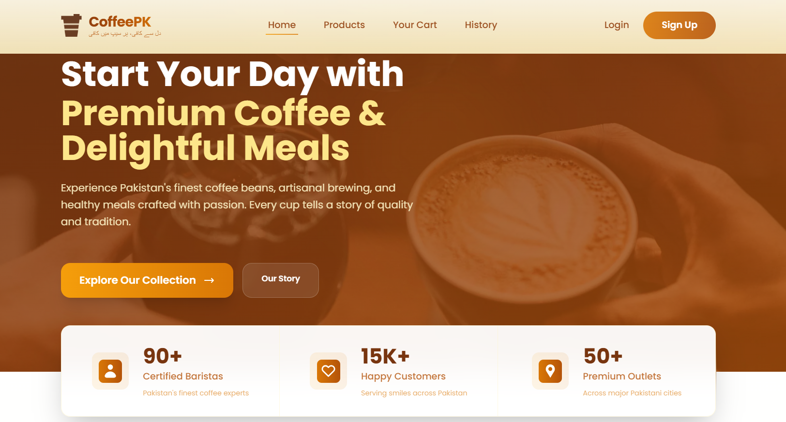
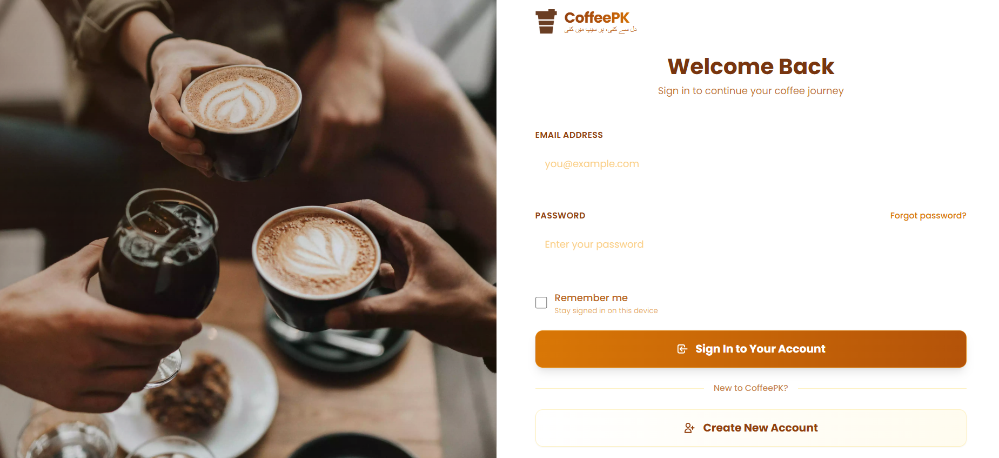
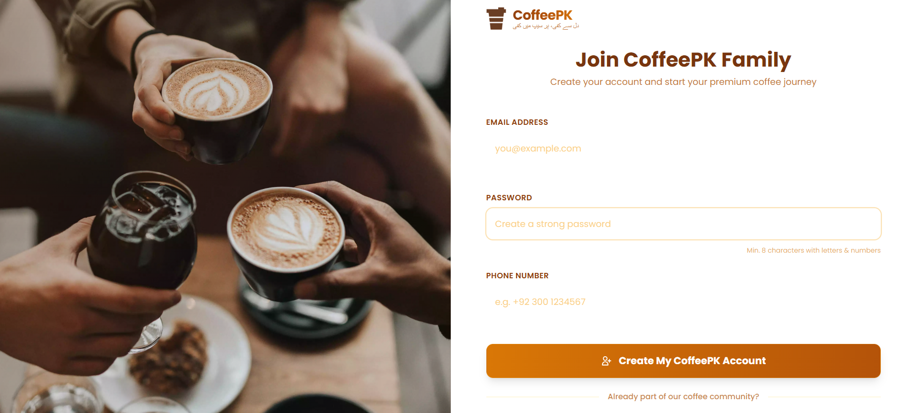
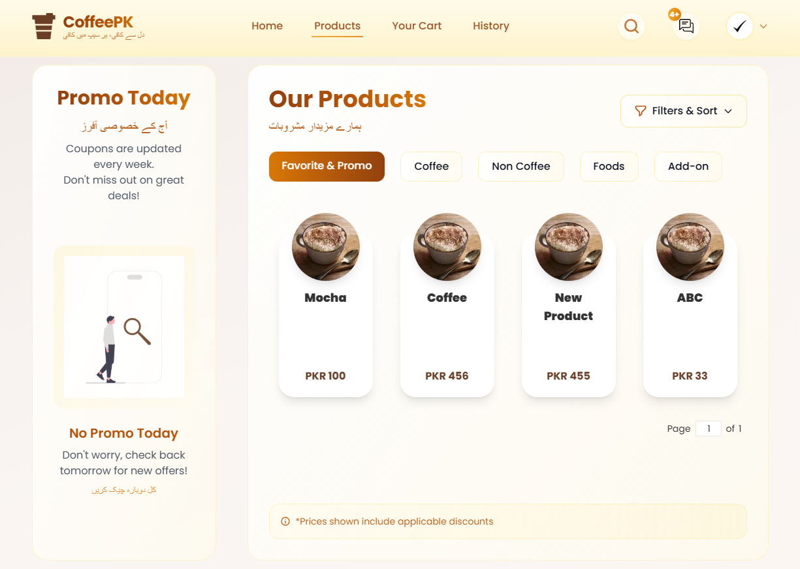
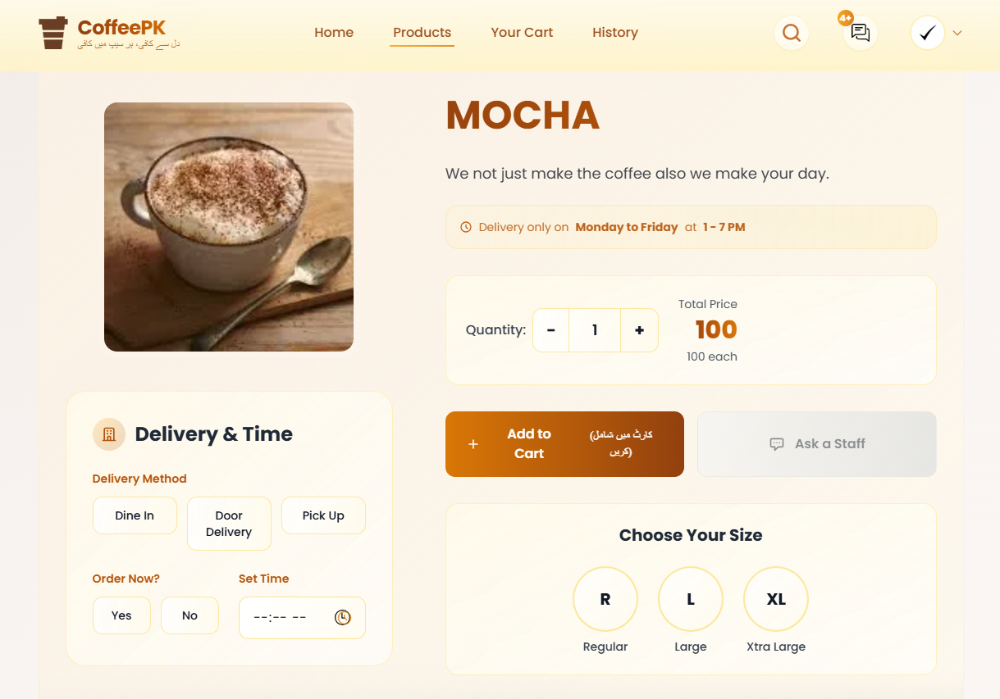
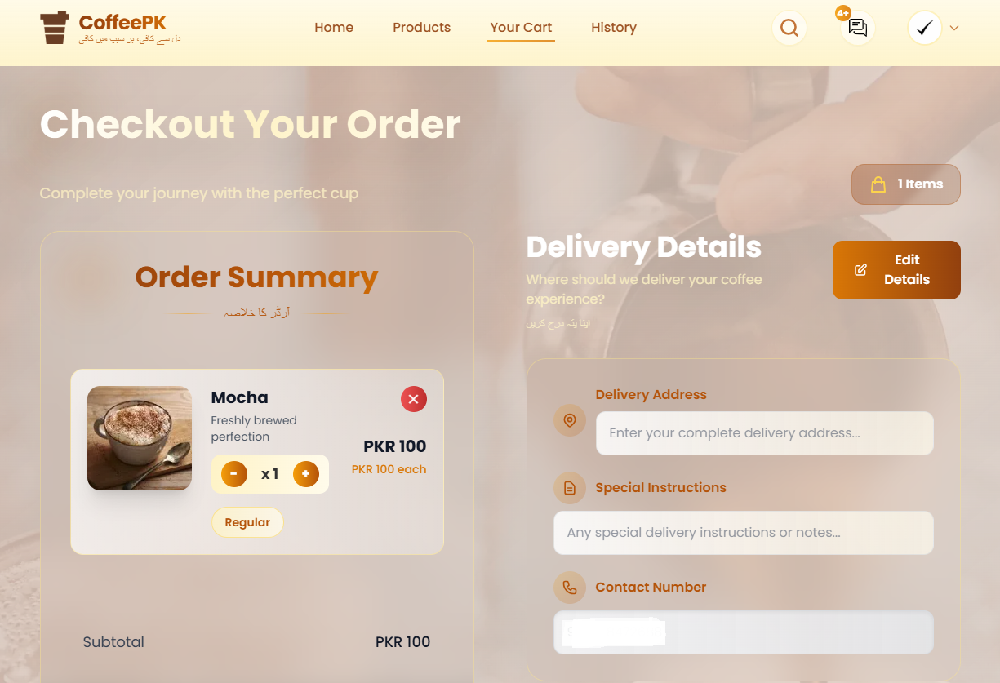
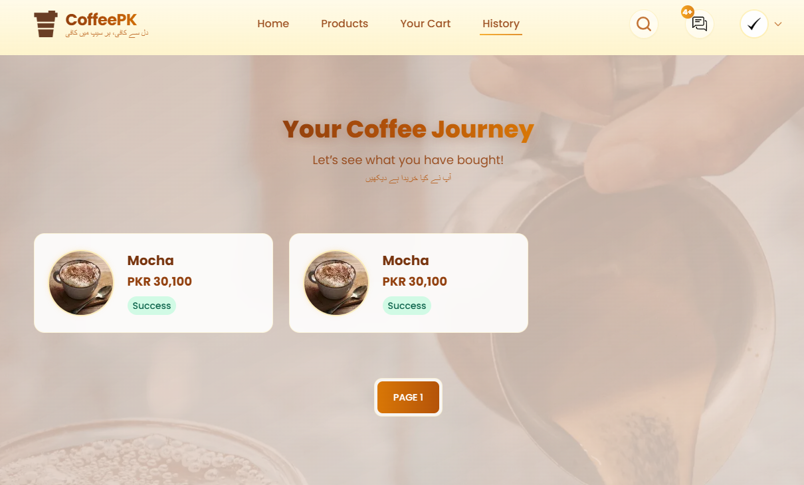

# CoffeePK Frontend

A responsive React frontend for a full-stack coffee commerce platform with authentication, product browsing, cart management, checkout flow, transaction history, and backend API integration.

CoffeePK Frontend provides the customer-facing interface of the CoffeePK commerce system. It is designed to work with the CoffeePK backend built using Node.js, Express.js, PostgreSQL, JWT authentication, and role-based access control.

---

## Overview

CoffeePK is a full-stack coffee commerce web application focused on providing a smooth online shopping experience for coffee products. The frontend handles the user interface and customer workflows, while the backend manages authentication, database operations, product data, transactions, and protected business logic.

This frontend demonstrates practical React development skills including routing, state management, reusable UI structure, API integration, persistent cart handling, and clean project documentation.

---

## Tech Stack

- React
- JavaScript
- React Router
- Redux Toolkit
- Redux Persist
- Axios
- Tailwind CSS
- DaisyUI
- React Hot Toast
- CSS

---

## Key Features

### Customer Features

- User registration
- User login
- Product browsing
- Product details view
- Cart management
- Checkout/order flow
- Transaction history
- Responsive user interface
- Backend API integration

### Frontend Engineering Features

- Component-based React structure
- Page-based routing
- Redux-based state management
- Persistent state handling with Redux Persist
- Environment-based API URL configuration
- Reusable components and utility functions
- Clean folder organization
- Screenshot-supported GitHub documentation

---

## Project Screenshots

### Home Page



### Login Page



### Register Page



### Products Page



### Product Details Page



### Cart Page



### Transaction History Page



---

## Folder Structure

```txt
CoffeePK-frontend/
├── public/
├── screenshots/
│   ├── 01-home-page.png
│   ├── 02-login-page.png
│   ├── 03-register-page.png
│   ├── 04-products-page.png
│   ├── 05-product-details-page.png
│   ├── 06-cart-page.png
│   └── 07-transaction-history-page.png
├── src/
│   ├── assets/
│   ├── components/
│   ├── pages/
│   │   ├── Admin/
│   │   ├── Auth/
│   │   ├── Cart/
│   │   ├── Error/
│   │   ├── History/
│   │   ├── Products/
│   │   ├── Profile/
│   │   ├── Promo/
│   │   └── Mainpage.jsx
│   ├── redux/
│   ├── styles/
│   ├── tests/
│   ├── utils/
│   ├── index.js
│   ├── router.js
│   ├── reportWebVitals.js
│   └── setupTests.js
├── .env.example
├── .gitignore
├── package.json
├── package-lock.json
├── tailwind.config.js
└── README.md
```

---

## Environment Variables

Create a `.env` file in the frontend root directory.

Use `.env.example` as a reference:

```env
REACT_APP_API_BASE_URL=http://localhost:8080
```

The real `.env` file is ignored by Git and should not be pushed to GitHub.

---

## Installation and Setup

### 1. Clone the Repository

```bash
git clone https://github.com/Shahzaib891/CoffeePK-FullStack-Commerce-Platform.git
```

### 2. Navigate to the Frontend Folder

```bash
cd CoffeePK-FullStack-Commerce-Platform/frontend
```

### 3. Install Dependencies

```bash
npm install
```

### 4. Create Environment File

Create a `.env` file in the frontend root folder and add:

```env
REACT_APP_API_BASE_URL=http://localhost:8080
```

### 5. Start the Frontend

```bash
npm start
```

The application usually runs at:

```txt
http://localhost:3000
```

---

## Backend Requirement

This frontend requires the CoffeePK backend to be running for API-connected features such as login, product loading, cart actions, checkout, and transaction history.

Expected backend URL:

```txt
http://localhost:8080
```

Backend stack:

- Node.js
- Express.js
- PostgreSQL
- JWT Authentication
- Role-based access control

---

## Available Scripts

### Start Development Server

```bash
npm start
```

### Create Production Build

```bash
npm run build
```

### Run Tests

```bash
npm test
```

---

## Portfolio Value

This project demonstrates practical frontend development skills required for software development and full-stack internship roles.

It highlights:

- React application structure
- Commerce-based UI development
- Authentication screens
- API-connected frontend workflows
- Product and cart management
- Checkout user flow
- Transaction history display
- Redux state management
- Environment-based configuration
- Clean GitHub documentation

---

## Future Improvements

- Improve admin dashboard with live backend statistics
- Add advanced product filtering and sorting
- Add loading skeletons for product pages
- Improve checkout validation
- Add order status tracking
- Improve mobile responsiveness
- Add automated frontend tests

---

## Author

**Shahzaib Safdar**  
BS Computer Science  
Air University, Islamabad  

GitHub: [Shahzaib891](https://github.com/Shahzaib891)

---

## Note

This folder contains the frontend part of the CoffeePK full-stack commerce project. The backend must be configured and running separately for full functionality.